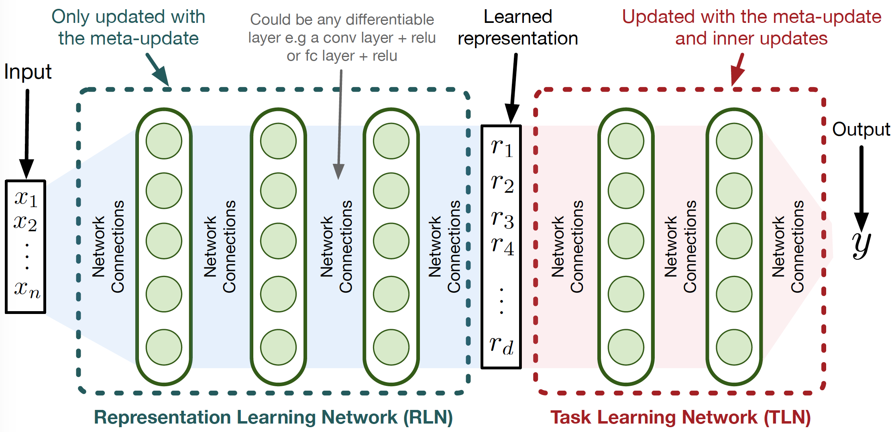
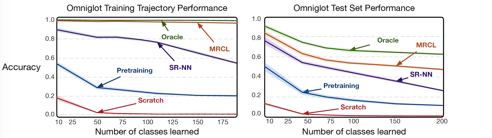
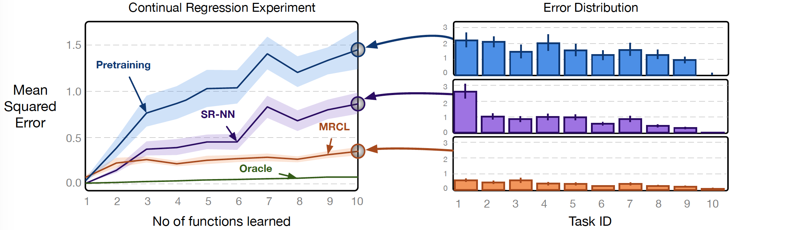

# mrcl (To be presented at NeurIPS19)

Paper : https://arxiv.org/abs/1905.12588

<div>

                                                                                                  </div>                                                                                        


### Learning MRCL Representations
To learn representations for omnigtot run the following command:
``` bash
python mrcl_classification.py --rln 6 --update_lr 0.03 --name mrcl_omniglot --update_step 20 --steps 15000
```

This will store the learned model at ../results/DDMonthYYYY/Omniglot/0.0001/mrcl_omniglot)

For learning represenations for Incremental Sine Waves, run:
``` bash
python mrcl_regression.py --update_step 40 --meta_lr 0.0001 --update_lr 0.003 --tasks 10 --capacity 10 --width 300 --rln 6
```
This will store the learned model at ../results/DDMonthYYYY/Sin/0.0001/mrcl_regression)

### Evaluating MRCL Representations 
We provide trained models at https://drive.google.com/drive/folders/1vHHT5kxtgx8D4JHYg25iA-C31O5OjAQz?usp=sharing which can be used to evaluate performance on the continual learning benchmarks. 

To evaluate performance on test trajectories of omniglot run: 
``` bash
python evaluate_classification.py --rln 6 --model ./trained_models/split_omniglot_mrcl.model --name Omni_test_traj --test --runs 50
```

Exclude the --test argument to get result on training trajectories (Used to measure forgetting). 

Results will be stored in a json file in "../results/DDMonthYYYY/Omniglot/eval/Omni_test_traj_0"

Finally, to evaluate performance on the Incremental Sin task, run the following:

``` bash
python evaluate_regression.py --model ./trained_models/incremental_sine_mrcl.model --name sine_test_set --rln 6 --tasks 10 --capacity 10 --runs 50
```

results will be stored in a json file in ""../results/DDMonthYYYY/Sin/eval/Sine_traj_0"

### Visualizing Representations

To visualize representations for different omniglot models, run 

``` bash
python visualize_representations.py --name MRCL_rep_study --model ./trained_models/split_omniglot_mrcl.model
```

### Results

#### Classification Results
The accuracy curve averaged over 50 runs as we learn more classes sequentially. The error bars represent 95% confidence intervals drawn using 1,000 bootstraps. We report results on both the training trajectory (left) and a held out dataset that has the same classes as the training trajectory (right).

 Online updates starting from MRCL are capable of learning 200 classes with little to no forgetting. Other representations, such as pretraining and SR-NN suffer from noticeable forgetting on the other hand. MRCL also generalizes better than the other methods on the unseen held out set. Note that the Oracle, learned using multiple, IID passes over the trajectory, represents an upper bound on the performance, reflecting the inherent inaccuracy when training on an increasing number of classes. 
#### Regression Results
Mean squared error across all 10 regression tasks. The x-axis in (a) corresponds to seeing all data points of samples for class 1, then class 2 and so on. These learning curves are averaged over 50 runs, with error bars representing 95% confidence interval drawn by 1,000 bootstraps.

We can see that the representation trained on iid data---pretraining---is not effective for online updating. Notice that in the final prediction accuracy in (b), pretraining and SR-NN representations have accurate predictions for task 10, but high error for earlier tasks. MRCL, on the other hand, has a slight skew in error towards later tasks in learning but is largely robust.

### References
1. Meta-learning code has been taken and modified from : https://github.com/dragen1860/MAML-Pytorch
2. For EWC, MER, and ER-Reservoir experiments, we modify the following implementation to be able to load our models : https://github.com/mattriemer/MER
